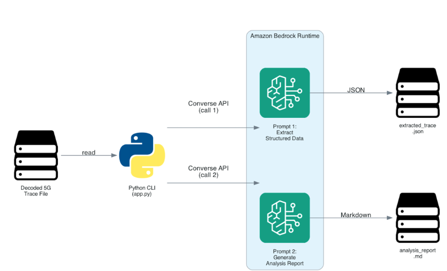

# Amazon Bedrock 5G Signaling Trace Analyzer

An AI-powered solution that uses Amazon Bedrock to analyze decoded 5G signaling traces and generate structured insights for telecom engineers.

## Overview

This solution uses a two-step approach:

1. **Structured extraction** — A first Amazon Bedrock call converts a decoded 5G trace into structured JSON, capturing message order, protocol layers, identifiers, and security context.
2. **Technical analysis** — A second Amazon Bedrock call uses that JSON to generate a telecom-focused Markdown report.



## Features

- Extracts ordered signaling messages across NAS and NGAP layers
- Identifies protocol phases (Registration, Authentication, Security, Context Setup)
- Captures key identifiers (SUCI, GUTI, NGAP IDs, TAC, NSSAI)
- Detects incomplete procedures and flags uncertainty
- Generates technical analysis reports for telecom engineers
- Identifies minimum 3GPP release compatibility

## Prerequisites

- Python 3.10 or later
- AWS CLI configured with credentials ([IAM Identity Center recommended](https://docs.aws.amazon.com/singlesignon/latest/userguide/what-is.html))
- Access to Amazon Bedrock with a supported model enabled
- IAM permissions for `bedrock:InvokeModel`

## Quick start

```bash
# Clone the repository
git clone https://github.com/daoudmo/amazon-bedrock-5g-signaling-analyzer.git
cd amazon-bedrock-5g-signaling-analyzer

# Create and activate virtual environment
python3 -m venv .venv
source .venv/bin/activate

# Install dependencies
pip install -r requirements.txt

# Run with the sample trace
python app.py

# Run with the incomplete trace
python app.py input/incomplete_5g_registration_trace.txt
```

## Output

The solution generates two files per run in the `output/` directory:

- `<trace_name>_extracted.json` — Structured JSON extraction
- `<trace_name>_analysis.md` — Technical Markdown report

## Configuration

Edit the following variables in `app.py`:

```python
# Update to your preferred Region where the model is available
REGION = "us-east-1"

# Cross-region inference profile ID. Check Amazon Bedrock documentation
# for supported models and current inference profile IDs in your Region.
MODEL_ID = "us.anthropic.claude-sonnet-4-20250514-v1:0"
```

## Project structure

```
├── app.py                 Main application (orchestrates the workflow)
├── prompts.py             Extraction and analysis prompts
├── bedrock_utils.py       Bedrock invocation helper
├── requirements.txt       Python dependencies
├── input/
│   ├── sample_5g_registration_trace.txt       Complete registration trace
│   └── incomplete_5g_registration_trace.txt   Trace with missing messages
└── sample_output/
    ├── sample_5g_registration_trace_extracted.json
    ├── sample_5g_registration_trace_analysis.md
    ├── incomplete_5g_registration_trace_extracted.json
    └── incomplete_5g_registration_trace_analysis.md
```

## Using your own traces

This solution accepts any decoded 5G signaling trace in human-readable text form. You can generate decoded traces from PCAP files using tshark:

```bash
tshark -r capture.pcap -d sctp.port==38412,ngap -V > input/my_trace.txt
```

The solution does not require a specific format or schema. It handles variations in layout across different tools (Wireshark, tshark, Netscout, Gigamon, and vendor-specific analyzers).

## Cost

This solution uses Amazon Bedrock on-demand inference. Charges are per API call — no persistent resources are created. See [Amazon Bedrock pricing](https://aws.amazon.com/bedrock/pricing/) for current rates.

## Clean up

No persistent AWS resources are created. To stop incurring charges, simply stop running the application. If you created an IAM user or role specifically for this solution, remove it from the AWS Management Console.

## Security

- This solution does not store trace data in AWS. All processing is done via API calls, and Amazon Bedrock does not use your data to train models.
- The sample traces use test network PLMN 001-01 and do not contain real subscriber data.
- See [CONTRIBUTING](CONTRIBUTING.md) for security issue reporting.

## Related blog post

[Build an AI-powered 5G signaling trace analyzer using Amazon Bedrock](link-to-blog-post)

## License

This project is licensed under the MIT-0 License. See the [LICENSE](LICENSE) file.
